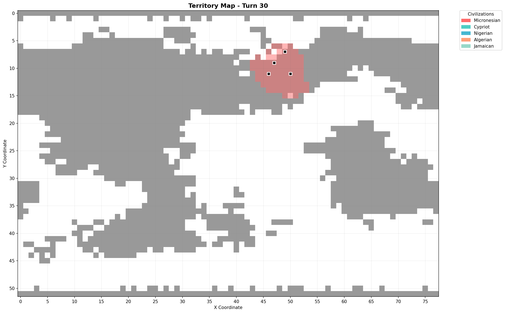
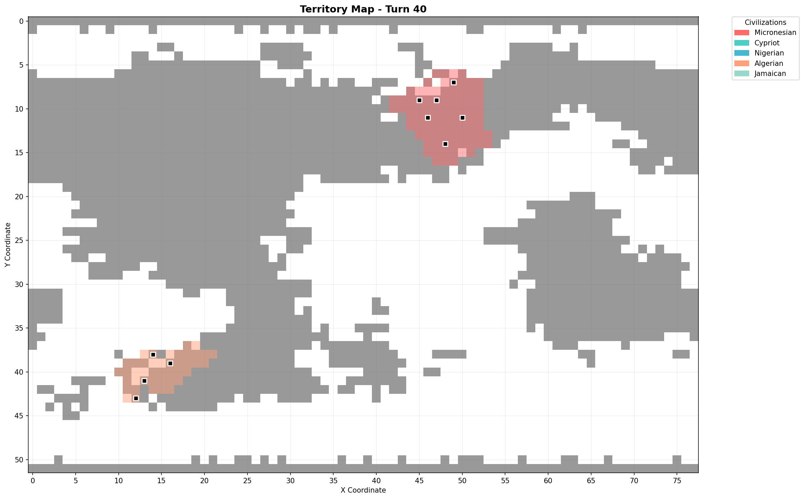
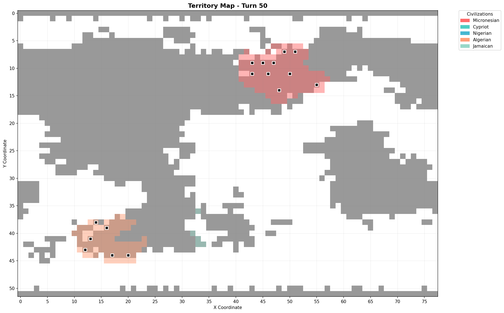

WORLD REPORT TXT v1
Game ID: seed1515
Snapshot turn: 60
Turns analyzed: 1..60
Map size: 78x52

## CIVILIZATIONS

ID | Name        | Adjective   | Nation ID
|---|-------------|-------------|----------|
0  | Micronesian | Micronesian | 322      
1  | Cypriot     | Cypriot     | 133      
2  | Nigerian    | Nigerian    | 352      
3  | Algerian    | Algerian    | 14       
4  | Jamaican    | Jamaican    | 241      
5  | Barbarian   | Barbarian   | 558      
6  | Pirate      | Pirate      | 559      
7  | Fijian      | Fijian      | 164      
8  | Libyan      | Libyan      | 281      

## CURRENT STATE (TURN 60)

ID | Name        | Score | Rank | Government | Treasury | Population | Techs | Wonders | Cities | Territory | Units | Military | Science | Trade | Food  | Shields
|---|-------------|-------|------|------------|----------|------------|-------|---------|--------|-----------|-------|----------|---------|-------|-------|--------|
0  | Micronesian | 38    | NA   | Despotism  | 354.0    | 21.0       | 9     | 1       | 13     | 154       | 6     | 2        | 60      | 21.0  | 42.0  | 39.0   
1  | Cypriot     | -1    | NA   | Anarchy    | 0.0      | 0.0        | 12    | 0       | 0      | 0         | 0     | 0        | 80      | 36.0  | 72.0  | 53.0   
2  | Nigerian    | 50    | NA   | Despotism  | 433.0    | 2.0        | 10    | 0       | 1      | 11        | 0     | 0        | 60      | 44.0  | 88.0  | 60.0   
3  | Algerian    | 35    | NA   | Despotism  | 415.0    | 11.0       | 8     | 0       | 6      | 77        | 0     | 0        | 60      | 53.0  | 106.0 | 35.0   
4  | Jamaican    | 31    | NA   | Despotism  | 382.0    | 14.0       | 8     | 0       | 8      | 64        | 0     | 0        | 60      | 40.0  | 80.0  | 28.0   
5  | Barbarian   | NA    | NA   | NA         | None     | None       | None  | None    | None   | None      | None  | None     | None    | None  | None  | None   
6  | Pirate      | NA    | NA   | NA         | None     | None       | None  | None    | None   | None      | None  | None     | None    | None  | None  | None   
7  | Fijian      | NA    | NA   | NA         | None     | None       | None  | None    | None   | None      | None  | None     | None    | None  | None  | None   
8  | Libyan      | NA    | NA   | NA         | None     | None       | None  | None    | None   | None      | None  | None     | None    | None  | None  | None   

GOVERNMENT TIMELINE (derived from recordings)
Each entry is a change point (turn number -> new government); the first entry is the first observed government.
0 Micronesian: 1 Despotism
1 Cypriot: 1 Anarchy
2 Nigerian: 1 Anarchy; 19 Despotism
3 Algerian: 1 Anarchy; 24 Despotism
4 Jamaican: 1 Anarchy; 52 Despotism
5 Barbarian: NA (no changes observed)
6 Pirate: NA (no changes observed)
7 Fijian: NA (no changes observed)
8 Libyan: NA (no changes observed)

TREASURY (sampled every 5 turns)
turns: 1, 5, 10, 15, 20, 25, 30, 35, 40, 45, 50, 55, 60
0 Micronesian: 50.0, 56.0, 66.0, 127.0, 142.0, 157.0, 176.0, 196.0, 216.0, 237.0, 269.0, 309.0, 354.0
1 Cypriot: 0.0, 0.0, 0.0, 0.0, 0.0, 0.0, 0.0, 0.0, 0.0, 0.0, 0.0, 0.0, 0.0
2 Nigerian: 0.0, 0.0, 0.0, 0.0, 163.0, 207.0, 232.0, 257.0, 282.0, 315.0, 359.0, 396.0, 433.0
3 Algerian: 0.0, 0.0, 0.0, 0.0, 0.0, 123.0, 142.0, 166.0, 194.0, 237.0, 370.0, 395.0, 415.0
4 Jamaican: 0.0, 0.0, 0.0, 0.0, 0.0, 0.0, 0.0, 0.0, 0.0, 0.0, 0.0, 293.0, 382.0
5 Barbarian: NA, NA, NA, NA, NA, NA, NA, NA, NA, NA, NA, NA, NA
6 Pirate: NA, NA, NA, NA, NA, NA, NA, NA, NA, NA, NA, NA, NA
7 Fijian: NA, NA, NA, NA, NA, NA, NA, NA, NA, NA, NA, NA, NA
8 Libyan: NA, NA, NA, NA, NA, NA, NA, NA, NA, NA, NA, NA, NA

POPULATION (sampled every 5 turns)
turns: 1, 5, 10, 15, 20, 25, 30, 35, 40, 45, 50, 55, 60
0 Micronesian: 0.0, 2.0, 3.0, 4.0, 5.0, 6.0, 6.0, 9.0, 12.0, 9.0, 16.0, 19.0, 21.0
1 Cypriot: 0.0, 0.0, 0.0, 0.0, 0.0, 0.0, 0.0, 0.0, 0.0, 0.0, 0.0, 0.0, 0.0
2 Nigerian: 0.0, 0.0, 0.0, 0.0, 0.0, 0.0, 0.0, 0.0, 0.0, 0.0, 0.0, 0.0, 2.0
3 Algerian: 0.0, 0.0, 0.0, 0.0, 0.0, 0.0, 0.0, 0.0, 6.0, 11.0, 11.0, 11.0, 11.0
4 Jamaican: 0.0, 0.0, 0.0, 0.0, 0.0, 0.0, 0.0, 0.0, 0.0, 0.0, 0.0, 7.0, 14.0
5 Barbarian: NA, NA, NA, NA, NA, NA, NA, NA, NA, NA, NA, NA, NA
6 Pirate: NA, NA, NA, NA, NA, NA, NA, NA, NA, NA, NA, NA, NA
7 Fijian: NA, NA, NA, NA, NA, NA, NA, NA, NA, NA, NA, NA, NA
8 Libyan: NA, NA, NA, NA, NA, NA, NA, NA, NA, NA, NA, NA, NA

TECHS KNOWN (sampled every 5 turns)
turns: 1, 5, 10, 15, 20, 25, 30, 35, 40, 45, 50, 55, 60
0 Micronesian: 1, 1, 1, 1, 2, 3, 4, 5, 5, 6, 7, 7, 9
1 Cypriot: 1, 1, 1, 2, 3, 3, 5, 6, 7, 7, 9, 9, 12
2 Nigerian: 1, 1, 1, 2, 2, 3, 4, 4, 5, 6, 9, 9, 10
3 Algerian: 1, 1, 1, 2, 2, 3, 4, 4, 5, 5, 7, 8, 8
4 Jamaican: 1, 1, 1, 2, 2, 3, 4, 5, 5, 6, 7, 7, 8
5 Barbarian: NA, NA, NA, NA, NA, NA, NA, NA, NA, NA, NA, NA, NA
6 Pirate: NA, NA, NA, NA, NA, NA, NA, NA, NA, NA, NA, NA, NA
7 Fijian: NA, NA, NA, NA, NA, NA, NA, NA, NA, NA, NA, NA, NA
8 Libyan: NA, NA, NA, NA, NA, NA, NA, NA, NA, NA, NA, NA, NA

WONDERS DISCOVERED (sampled every 5 turns)
turns: 1, 5, 10, 15, 20, 25, 30, 35, 40, 45, 50, 55, 60
0 Micronesian: 0, 1, 1, 1, 1, 1, 1, 1, 1, 1, 1, 1, 1
1 Cypriot: 0, 0, 0, 0, 0, 0, 0, 0, 0, 0, 0, 0, 0
2 Nigerian: 0, 0, 0, 0, 0, 0, 0, 0, 0, 0, 0, 0, 0
3 Algerian: 0, 0, 0, 0, 0, 0, 0, 0, 0, 0, 0, 0, 0
4 Jamaican: 0, 0, 0, 0, 0, 0, 0, 0, 0, 0, 0, 0, 0
5 Barbarian: NA, NA, NA, NA, NA, NA, NA, NA, NA, NA, NA, NA, NA
6 Pirate: NA, NA, NA, NA, NA, NA, NA, NA, NA, NA, NA, NA, NA
7 Fijian: NA, NA, NA, NA, NA, NA, NA, NA, NA, NA, NA, NA, NA
8 Libyan: NA, NA, NA, NA, NA, NA, NA, NA, NA, NA, NA, NA, NA

CITIES COUNT (sampled every 5 turns)
turns: 1, 5, 10, 15, 20, 25, 30, 35, 40, 45, 50, 55, 60
0 Micronesian: 0, 2, 2, 3, 3, 3, 4, 5, 6, 7, 10, 11, 13
1 Cypriot: 0, 0, 0, 0, 0, 0, 0, 0, 0, 0, 0, 0, 0
2 Nigerian: 0, 0, 0, 0, 0, 0, 0, 0, 0, 0, 0, 0, 1
3 Algerian: 0, 0, 0, 0, 0, 0, 0, 0, 4, 6, 6, 6, 6
4 Jamaican: 0, 0, 0, 0, 0, 0, 0, 0, 0, 0, 0, 4, 8
5 Barbarian: NA, NA, NA, NA, NA, NA, NA, NA, NA, NA, NA, NA, NA
6 Pirate: NA, NA, NA, NA, NA, NA, NA, NA, NA, NA, NA, NA, NA
7 Fijian: NA, NA, NA, NA, NA, NA, NA, NA, NA, NA, NA, NA, NA
8 Libyan: NA, NA, NA, NA, NA, NA, NA, NA, NA, NA, NA, NA, NA

TERRITORY SIZE (sampled every 5 turns)
turns: 1, 5, 10, 15, 20, 25, 30, 35, 40, 45, 50, 55, 60
0 Micronesian: 0, 43, 52, 60, 63, 68, 75, 77, 85, 98, 122, 141, 154
1 Cypriot: 0, 0, 0, 0, 0, 0, 0, 0, 0, 0, 0, 0, 0
2 Nigerian: 0, 0, 0, 0, 0, 0, 0, 0, 0, 0, 0, 1, 11
3 Algerian: 0, 0, 0, 0, 0, 0, 0, 0, 43, 77, 77, 77, 77
4 Jamaican: 0, 0, 0, 0, 0, 0, 0, 0, 0, 0, 5, 37, 64
5 Barbarian: NA, NA, NA, NA, NA, NA, NA, NA, NA, NA, NA, NA, NA
6 Pirate: NA, NA, NA, NA, NA, NA, NA, NA, NA, NA, NA, NA, NA
7 Fijian: NA, NA, NA, NA, NA, NA, NA, NA, NA, NA, NA, NA, NA
8 Libyan: NA, NA, NA, NA, NA, NA, NA, NA, NA, NA, NA, NA, NA

SCIENCE (sampled every 5 turns)
turns: 1, 5, 10, 15, 20, 25, 30, 35, 40, 45, 50, 55, 60
0 Micronesian: 60, 60, 60, 60, 60, 60, 60, 60, 60, 60, 60, 60, 60
1 Cypriot: 60, 60, 60, 60, 60, 60, 60, 60, 60, 60, 60, 60, 80
2 Nigerian: 60, 60, 60, 60, 60, 60, 60, 60, 60, 60, 60, 60, 60
3 Algerian: 60, 60, 60, 60, 60, 60, 60, 60, 60, 60, 60, 60, 60
4 Jamaican: 60, 60, 60, 60, 60, 60, 60, 60, 60, 60, 60, 60, 60
5 Barbarian: NA, NA, NA, NA, NA, NA, NA, NA, NA, NA, NA, NA, NA
6 Pirate: NA, NA, NA, NA, NA, NA, NA, NA, NA, NA, NA, NA, NA
7 Fijian: NA, NA, NA, NA, NA, NA, NA, NA, NA, NA, NA, NA, NA
8 Libyan: NA, NA, NA, NA, NA, NA, NA, NA, NA, NA, NA, NA, NA

TRADE PRODUCTION (sampled every 5 turns)
turns: 1, 5, 10, 15, 20, 25, 30, 35, 40, 45, 50, 55, 60
0 Micronesian: 0.0, 2.0, 3.0, 4.0, 5.0, 6.0, 6.0, 9.0, 12.0, 9.0, 16.0, 19.0, 21.0
1 Cypriot: 0.0, 5.0, 5.0, 7.0, 8.0, 9.0, 12.0, 14.0, 17.0, 22.0, 25.0, 28.0, 36.0
2 Nigerian: 0.0, 10.0, 11.0, 12.0, 13.0, 14.0, 17.0, 21.0, 21.0, 28.0, 30.0, 36.0, 44.0
3 Algerian: 0.0, 12.0, 12.0, 17.0, 17.0, 22.0, 23.0, 22.0, 29.0, 41.0, 47.0, 52.0, 53.0
4 Jamaican: 0.0, 14.0, 14.0, 16.0, 23.0, 20.0, 23.0, 26.0, 25.0, 28.0, 33.0, 38.0, 40.0
5 Barbarian: NA, NA, NA, NA, NA, NA, NA, NA, NA, NA, NA, NA, NA
6 Pirate: NA, NA, NA, NA, NA, NA, NA, NA, NA, NA, NA, NA, NA
7 Fijian: NA, NA, NA, NA, NA, NA, NA, NA, NA, NA, NA, NA, NA
8 Libyan: NA, NA, NA, NA, NA, NA, NA, NA, NA, NA, NA, NA, NA

FOOD PRODUCTION (sampled every 5 turns)
turns: 1, 5, 10, 15, 20, 25, 30, 35, 40, 45, 50, 55, 60
0 Micronesian: 0.0, 4.0, 6.0, 8.0, 10.0, 12.0, 12.0, 18.0, 24.0, 18.0, 32.0, 38.0, 42.0
1 Cypriot: 0.0, 10.0, 10.0, 14.0, 16.0, 18.0, 24.0, 28.0, 34.0, 44.0, 50.0, 56.0, 72.0
2 Nigerian: 0.0, 20.0, 22.0, 24.0, 26.0, 28.0, 34.0, 42.0, 42.0, 56.0, 60.0, 72.0, 88.0
3 Algerian: 0.0, 24.0, 24.0, 34.0, 34.0, 44.0, 46.0, 44.0, 58.0, 82.0, 94.0, 104.0, 106.0
4 Jamaican: 0.0, 28.0, 28.0, 32.0, 46.0, 40.0, 46.0, 52.0, 50.0, 56.0, 66.0, 76.0, 80.0
5 Barbarian: NA, NA, NA, NA, NA, NA, NA, NA, NA, NA, NA, NA, NA
6 Pirate: NA, NA, NA, NA, NA, NA, NA, NA, NA, NA, NA, NA, NA
7 Fijian: NA, NA, NA, NA, NA, NA, NA, NA, NA, NA, NA, NA, NA
8 Libyan: NA, NA, NA, NA, NA, NA, NA, NA, NA, NA, NA, NA, NA

SHIELD PRODUCTION (sampled every 5 turns)
turns: 1, 5, 10, 15, 20, 25, 30, 35, 40, 45, 50, 55, 60
0 Micronesian: 0.0, 6.0, 6.0, 9.0, 9.0, 11.0, 11.0, 14.0, 18.0, 19.0, 27.0, 33.0, 39.0
1 Cypriot: 0.0, 7.0, 7.0, 9.0, 12.0, 13.0, 21.0, 20.0, 31.0, 28.0, 43.0, 47.0, 53.0
2 Nigerian: 0.0, 5.0, 5.0, 9.0, 11.0, 12.0, 21.0, 17.0, 25.0, 33.0, 39.0, 41.0, 60.0
3 Algerian: 0.0, 8.0, 8.0, 13.0, 14.0, 15.0, 18.0, 21.0, 24.0, 25.0, 26.0, 33.0, 35.0
4 Jamaican: 0.0, 4.0, 3.0, 5.0, 3.0, 7.0, 10.0, 8.0, 15.0, 16.0, 16.0, 24.0, 28.0
5 Barbarian: NA, NA, NA, NA, NA, NA, NA, NA, NA, NA, NA, NA, NA
6 Pirate: NA, NA, NA, NA, NA, NA, NA, NA, NA, NA, NA, NA, NA
7 Fijian: NA, NA, NA, NA, NA, NA, NA, NA, NA, NA, NA, NA, NA
8 Libyan: NA, NA, NA, NA, NA, NA, NA, NA, NA, NA, NA, NA, NA

UNITS COUNT (sampled every 5 turns)
turns: 1, 5, 10, 15, 20, 25, 30, 35, 40, 45, 50, 55, 60
0 Micronesian: 5, 3, 3, 3, 3, 5, 6, 5, 5, 8, 6, 9, 6
1 Cypriot: 0, 0, 0, 0, 0, 0, 0, 0, 0, 0, 0, 0, 0
2 Nigerian: 0, 0, 0, 0, 1, 1, 0, 0, 0, 0, 0, 0, 0
3 Algerian: 0, 0, 0, 0, 0, 0, 0, 0, 0, 0, 0, 0, 0
4 Jamaican: 0, 0, 0, 0, 0, 0, 0, 0, 0, 0, 0, 0, 0
5 Barbarian: NA, NA, NA, NA, NA, NA, NA, NA, NA, NA, NA, NA, NA
6 Pirate: NA, NA, NA, NA, NA, NA, NA, NA, NA, NA, NA, NA, NA
7 Fijian: NA, NA, NA, NA, NA, NA, NA, NA, NA, NA, NA, NA, NA
8 Libyan: NA, NA, NA, NA, NA, NA, NA, NA, NA, NA, NA, NA, NA

MILITARY UNITS COUNT (sampled every 5 turns)
turns: 1, 5, 10, 15, 20, 25, 30, 35, 40, 45, 50, 55, 60
0 Micronesian: 0, 0, 0, 0, 0, 1, 2, 2, 2, 2, 2, 2, 2
1 Cypriot: 0, 0, 0, 0, 0, 0, 0, 0, 0, 0, 0, 0, 0
2 Nigerian: 0, 0, 0, 0, 1, 1, 0, 0, 0, 0, 0, 0, 0
3 Algerian: 0, 0, 0, 0, 0, 0, 0, 0, 0, 0, 0, 0, 0
4 Jamaican: 0, 0, 0, 0, 0, 0, 0, 0, 0, 0, 0, 0, 0
5 Barbarian: NA, NA, NA, NA, NA, NA, NA, NA, NA, NA, NA, NA, NA
6 Pirate: NA, NA, NA, NA, NA, NA, NA, NA, NA, NA, NA, NA, NA
7 Fijian: NA, NA, NA, NA, NA, NA, NA, NA, NA, NA, NA, NA, NA
8 Libyan: NA, NA, NA, NA, NA, NA, NA, NA, NA, NA, NA, NA, NA

SCORES (derived from recordings)
turns: 1, 5, 10, 15, 20, 25, 30, 35, 40, 45, 50, 55, 60
0 Micronesian: 0, 2, 3, 4, 7, 10, 12, 17, 20, 20, 29, 32, 38
1 Cypriot: -1, -1, -1, -1, -1, -1, -1, -1, -1, -1, -1, -1, -1
2 Nigerian: -1, -1, -1, -1, 7, 10, 15, 15, 19, 28, 35, 39, 50
3 Algerian: -1, -1, -1, -1, -1, 11, 14, 16, 19, 23, 27, 34, 35
4 Jamaican: -1, -1, -1, -1, -1, -1, -1, -1, -1, -1, -1, 26, 31
5 Barbarian: NA, NA, NA, NA, NA, NA, NA, NA, NA, NA, NA, NA, NA
6 Pirate: NA, NA, NA, NA, NA, NA, NA, NA, NA, NA, NA, NA, NA
7 Fijian: NA, NA, NA, NA, NA, NA, NA, NA, NA, NA, NA, NA, NA
8 Libyan: NA, NA, NA, NA, NA, NA, NA, NA, NA, NA, NA, NA, NA

RANKINGS (derived from scores)
Turn 1: 1=Micronesian(0), 2=Cypriot(-1), 3=Nigerian(-1), 4=Algerian(-1), 5=Jamaican(-1)
Turn 5: 1=Micronesian(2), 2=Cypriot(-1), 3=Nigerian(-1), 4=Algerian(-1), 5=Jamaican(-1)
Turn 10: 1=Micronesian(3), 2=Cypriot(-1), 3=Nigerian(-1), 4=Algerian(-1), 5=Jamaican(-1)
Turn 15: 1=Micronesian(4), 2=Cypriot(-1), 3=Nigerian(-1), 4=Algerian(-1), 5=Jamaican(-1)
Turn 20: 1=Micronesian(7), 2=Nigerian(7), 3=Cypriot(-1), 4=Algerian(-1), 5=Jamaican(-1)
Turn 25: 1=Algerian(11), 2=Micronesian(10), 3=Nigerian(10), 4=Cypriot(-1), 5=Jamaican(-1)
Turn 30: 1=Nigerian(15), 2=Algerian(14), 3=Micronesian(12), 4=Cypriot(-1), 5=Jamaican(-1)
Turn 35: 1=Micronesian(17), 2=Algerian(16), 3=Nigerian(15), 4=Cypriot(-1), 5=Jamaican(-1)
Turn 40: 1=Micronesian(20), 2=Nigerian(19), 3=Algerian(19), 4=Cypriot(-1), 5=Jamaican(-1)
Turn 45: 1=Nigerian(28), 2=Algerian(23), 3=Micronesian(20), 4=Cypriot(-1), 5=Jamaican(-1)
Turn 50: 1=Nigerian(35), 2=Micronesian(29), 3=Algerian(27), 4=Cypriot(-1), 5=Jamaican(-1)
Turn 55: 1=Nigerian(39), 2=Algerian(34), 3=Micronesian(32), 4=Jamaican(26), 5=Cypriot(-1)
Turn 60: 1=Nigerian(50), 2=Micronesian(38), 3=Algerian(35), 4=Jamaican(31), 5=Cypriot(-1)

EVENT TYPES (exhaustive)
city_founded, city_conquered, city_destroyed, government_change, diplomatic_change, tech_discovered, wonder_completed
If a type does not appear in EVENTS, it did not occur in the analyzed turns.

EVENTS (chronological)
Turn | Type | Civ | Description | Metadata
--------------------------------------------------------------------------------
1 | tech_discovered | Micronesian | Micronesian discovered Tech #0 | tech_id=0, tech_name=Tech #0
1 | tech_discovered | Cypriot | Cypriot discovered Tech #0 | tech_id=0, tech_name=Tech #0
1 | tech_discovered | Nigerian | Nigerian discovered Tech #0 | tech_id=0, tech_name=Tech #0
1 | tech_discovered | Algerian | Algerian discovered Tech #0 | tech_id=0, tech_name=Tech #0
1 | tech_discovered | Jamaican | Jamaican discovered Tech #0 | tech_id=0, tech_name=Tech #0
2 | wonder_completed | Cypriot | Cypriot completed Palace in Levkosia | wonder_id=21, wonder_name=Palace, city_name=Levkosia
2 | wonder_completed | Nigerian | Nigerian completed Palace in Lagos | wonder_id=21, wonder_name=Palace, city_name=Lagos
2 | wonder_completed | Algerian | Algerian completed Palace in Algiers | wonder_id=21, wonder_name=Palace, city_name=Algiers
3 | city_founded | Micronesian | Palikir founded by Micronesian | city_id=130, city_name=Palikir
3 | city_founded | Micronesian | Kolonia founded by Micronesian | city_id=131, city_name=Kolonia
3 | wonder_completed | Micronesian | Micronesian completed Palace in Palikir | wonder_id=21, wonder_name=Palace, city_name=Palikir
3 | wonder_completed | Jamaican | Jamaican completed Palace in Montego Bay | wonder_id=21, wonder_name=Palace, city_name=Montego Bay
12 | tech_discovered | Cypriot | Cypriot discovered Masonry | tech_id=46, tech_name=Masonry
13 | tech_discovered | Algerian | Algerian discovered Masonry | tech_id=46, tech_name=Masonry
14 | tech_discovered | Jamaican | Jamaican discovered Masonry | tech_id=46, tech_name=Masonry
15 | city_founded | Micronesian | Weno founded by Micronesian | city_id=143, city_name=Weno
15 | tech_discovered | Nigerian | Nigerian discovered Masonry | tech_id=46, tech_name=Masonry
16 | tech_discovered | Micronesian | Micronesian discovered Masonry | tech_id=46, tech_name=Masonry
19 | government_change | Nigerian | Nigerian changed government from Anarchy to Despotism | from=Anarchy, to=Despotism
19 | tech_discovered | Cypriot | Cypriot discovered Ceremonial Burial | tech_id=10, tech_name=Ceremonial Burial
22 | tech_discovered | Algerian | Algerian discovered Alphabet | tech_id=2, tech_name=Alphabet
22 | tech_discovered | Jamaican | Jamaican discovered Alphabet | tech_id=2, tech_name=Alphabet
23 | tech_discovered | Micronesian | Micronesian discovered Warrior Code | tech_id=86, tech_name=Warrior Code
23 | tech_discovered | Nigerian | Nigerian discovered Ceremonial Burial | tech_id=10, tech_name=Ceremonial Burial
24 | government_change | Algerian | Algerian changed government from Anarchy to Despotism | from=Anarchy, to=Despotism
26 | tech_discovered | Cypriot | Cypriot discovered Horseback Riding | tech_id=35, tech_name=Horseback Riding
27 | city_founded | Micronesian | Tofol founded by Micronesian | city_id=167, city_name=Tofol
28 | tech_discovered | Algerian | Algerian discovered Pottery | tech_id=63, tech_name=Pottery
29 | tech_discovered | Cypriot | Cypriot discovered Alphabet | tech_id=2, tech_name=Alphabet
29 | tech_discovered | Nigerian | Nigerian discovered Alphabet | tech_id=2, tech_name=Alphabet
29 | tech_discovered | Jamaican | Jamaican discovered Pottery | tech_id=63, tech_name=Pottery
30 | tech_discovered | Micronesian | Micronesian discovered Bronze Working | tech_id=9, tech_name=Bronze Working
31 | city_founded | Micronesian | Lelu founded by Micronesian | city_id=172, city_name=Lelu
34 | tech_discovered | Micronesian | Micronesian discovered Alphabet | tech_id=2, tech_name=Alphabet
34 | tech_discovered | Jamaican | Jamaican discovered Horseback Riding | tech_id=35, tech_name=Horseback Riding
35 | tech_discovered | Cypriot | Cypriot discovered Code of Laws | tech_id=13, tech_name=Code of Laws
37 | city_founded | Algerian | Oran founded by Algerian | city_id=136, city_name=Oran
37 | tech_discovered | Nigerian | Nigerian discovered Code of Laws | tech_id=13, tech_name=Code of Laws
39 | city_founded | Algerian | Béchar founded by Algerian | city_id=176, city_name=Béchar
39 | city_founded | Algerian | Algiers founded by Algerian | city_id=129, city_name=Algiers
39 | tech_discovered | Cypriot | Cypriot discovered Writing | tech_id=87, tech_name=Writing
40 | city_founded | Algerian | Annaba founded by Algerian | city_id=163, city_name=Annaba
40 | city_founded | Micronesian | Tol founded by Micronesian | city_id=194, city_name=Tol
40 | tech_discovered | Algerian | Algerian discovered Mathematics | tech_id=48, tech_name=Mathematics
42 | city_founded | Algerian | Biskra founded by Algerian | city_id=137, city_name=Biskra
42 | tech_discovered | Micronesian | Micronesian discovered Code of Laws | tech_id=13, tech_name=Code of Laws
42 | tech_discovered | Jamaican | Jamaican discovered Code of Laws | tech_id=13, tech_name=Code of Laws
43 | city_founded | Algerian | Constantine founded by Algerian | city_id=169, city_name=Constantine
43 | tech_discovered | Nigerian | Nigerian discovered Map Making | tech_id=45, tech_name=Map Making
45 | city_founded | Micronesian | Colonia founded by Micronesian | city_id=210, city_name=Colonia
46 | city_founded | Micronesian | Nett founded by Micronesian | city_id=214, city_name=Nett
46 | city_founded | Micronesian | Kitti founded by Micronesian | city_id=215, city_name=Kitti
46 | city_founded | Micronesian | Dinay founded by Micronesian | city_id=213, city_name=Dinay
46 | tech_discovered | Algerian | Algerian discovered Code of Laws | tech_id=13, tech_name=Code of Laws
47 | tech_discovered | Micronesian | Micronesian discovered Writing | tech_id=87, tech_name=Writing
47 | tech_discovered | Jamaican | Jamaican discovered Writing | tech_id=87, tech_name=Writing
48 | tech_discovered | Cypriot | Cypriot discovered Literacy | tech_id=42, tech_name=Literacy
48 | tech_discovered | Nigerian | Nigerian discovered Writing | tech_id=87, tech_name=Writing
49 | tech_discovered | Cypriot | Cypriot discovered Warrior Code | tech_id=86, tech_name=Warrior Code
49 | tech_discovered | Algerian | Algerian discovered Bronze Working | tech_id=9, tech_name=Bronze Working
50 | tech_discovered | Nigerian | Nigerian discovered Literacy | tech_id=42, tech_name=Literacy
50 | tech_discovered | Nigerian | Nigerian discovered Pottery | tech_id=63, tech_name=Pottery
52 | city_founded | Jamaican | Savanna la Mar founded by Jamaican | city_id=171, city_name=Savanna la Mar
52 | city_founded | Jamaican | May Pen founded by Jamaican | city_id=224, city_name=May Pen
52 | city_founded | Micronesian | Nan Madol founded by Micronesian | city_id=239, city_name=Nan Madol
52 | government_change | Jamaican | Jamaican changed government from Anarchy to Despotism | from=Anarchy, to=Despotism
54 | city_founded | Jamaican | Montego Bay founded by Jamaican | city_id=134, city_name=Montego Bay
54 | city_founded | Jamaican | Port Royal founded by Jamaican | city_id=135, city_name=Port Royal
54 | tech_discovered | Algerian | Algerian discovered Writing | tech_id=87, tech_name=Writing
56 | tech_discovered | Micronesian | Micronesian discovered Literacy | tech_id=42, tech_name=Literacy
57 | city_founded | Jamaican | Saint Ann's Bay founded by Jamaican | city_id=190, city_name=Saint Ann's Bay
57 | city_founded | Nigerian | Katsina founded by Nigerian | city_id=232, city_name=Katsina
57 | tech_discovered | Cypriot | Cypriot discovered The Republic | tech_id=80, tech_name=The Republic
58 | city_founded | Jamaican | Kingston founded by Jamaican | city_id=193, city_name=Kingston
58 | city_founded | Jamaican | Port Antonio founded by Jamaican | city_id=253, city_name=Port Antonio
58 | tech_discovered | Micronesian | Micronesian discovered Map Making | tech_id=45, tech_name=Map Making
58 | tech_discovered | Jamaican | Jamaican discovered Literacy | tech_id=42, tech_name=Literacy
59 | city_founded | Micronesian | Fefen founded by Micronesian | city_id=268, city_name=Fefen
59 | city_founded | Micronesian | Madolenihmw founded by Micronesian | city_id=267, city_name=Madolenihmw
59 | tech_discovered | Cypriot | Cypriot discovered Map Making | tech_id=45, tech_name=Map Making
60 | city_founded | Jamaican | Spanish Town founded by Jamaican | city_id=154, city_name=Spanish Town
60 | tech_discovered | Cypriot | Cypriot discovered Bronze Working | tech_id=9, tech_name=Bronze Working
60 | tech_discovered | Nigerian | Nigerian discovered The Republic | tech_id=80, tech_name=The Republic

## TERRITORY MAPS

### Turn 10

### Turn 20

### Turn 30

### Turn 40

### Turn 50

### Turn 60

