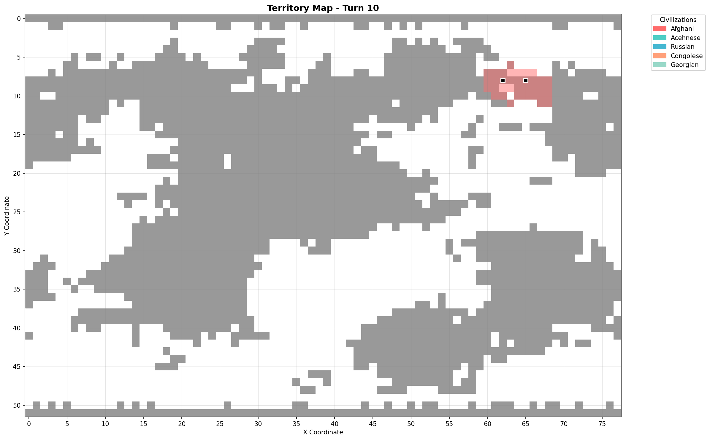
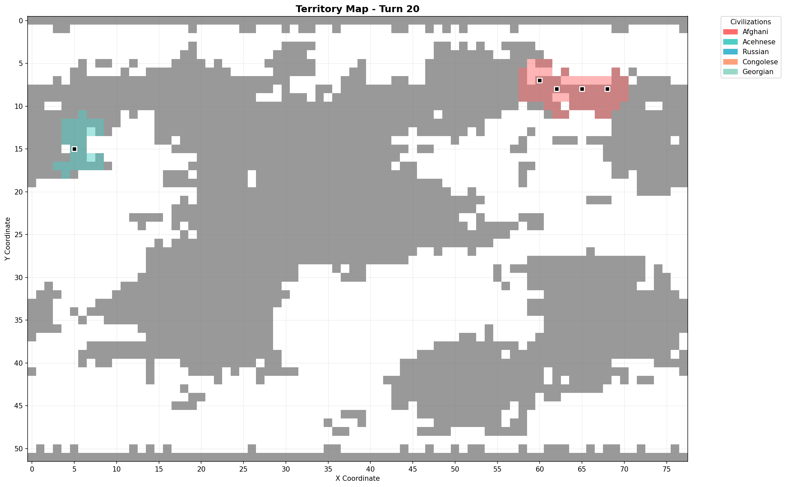
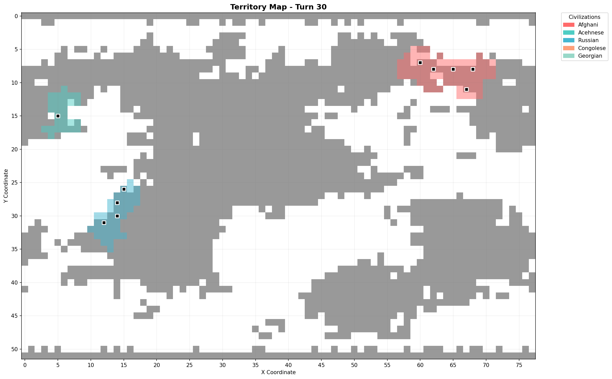
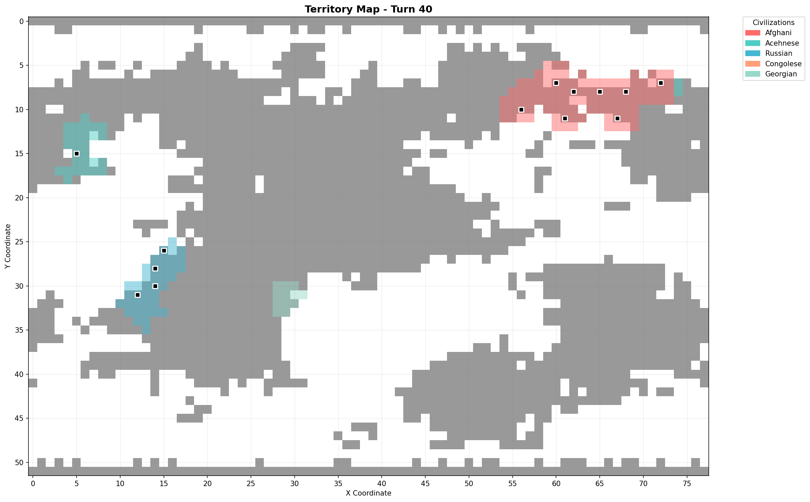
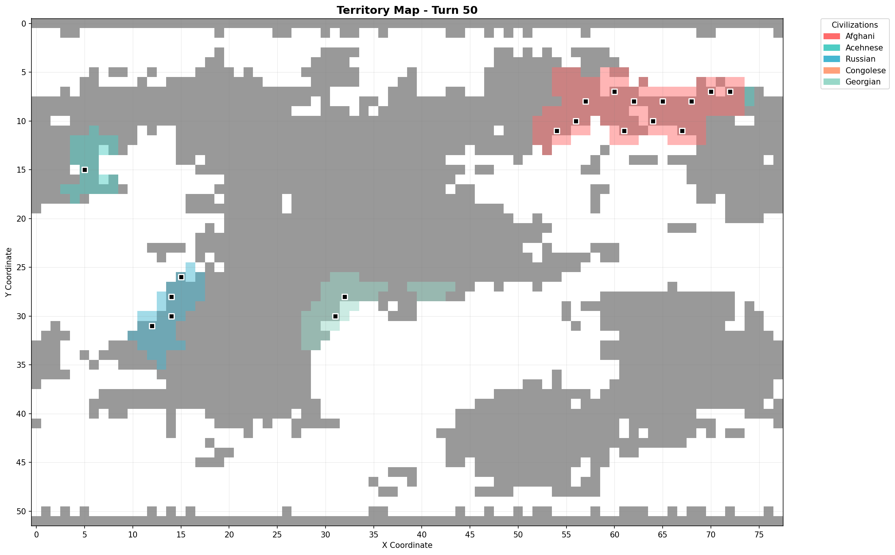
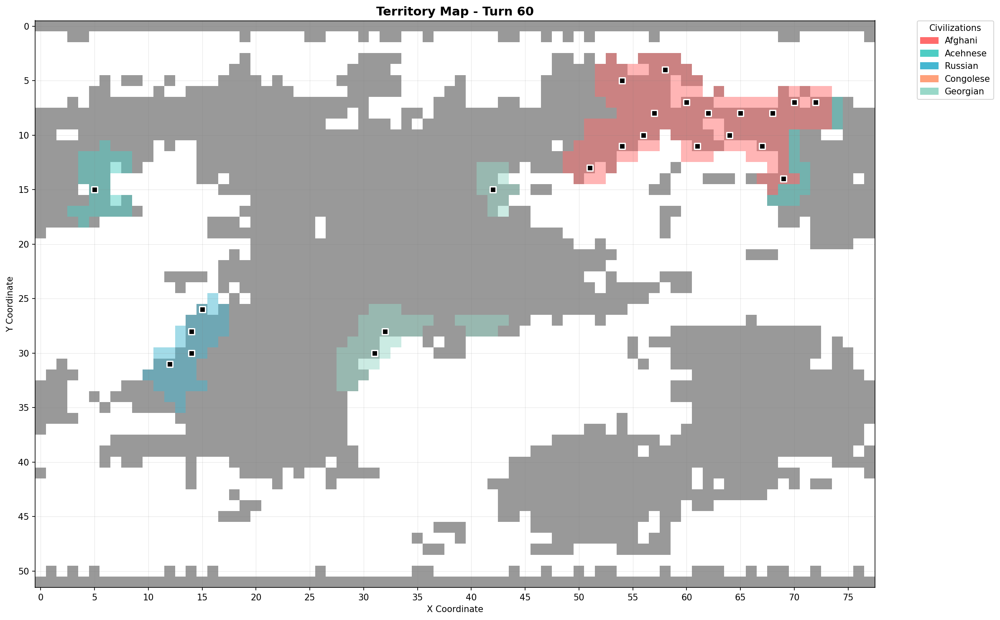

WORLD REPORT TXT v1
Game ID: seed1976
Snapshot turn: 60
Turns analyzed: 1..60
Map size: 78x52

## CIVILIZATIONS

ID | Name       | Adjective  | Nation ID
|---|------------|------------|----------|
0  | Afghani    | Afghani    | 6        
1  | Acehnese   | Acehnese   | 4        
2  | Russian    | Russian    | 409      
3  | Congolese  | Congolese  | 119      
4  | Georgian   | Georgian   | 183      
5  | Pirate     | Pirate     | 559      
6  | Barbarian  | Barbarian  | 558      
7  | Iranian    | Iranian    | 231      
8  | Pashtun    | Pashtun    | 387      
9  | Indonesian | Indonesian | 229      

## CURRENT STATE (TURN 60)

ID | Name       | Score | Rank | Government | Treasury | Population | Techs | Wonders | Cities | Territory | Units | Military | Science | Trade | Food  | Shields
|---|------------|-------|------|------------|----------|------------|-------|---------|--------|-----------|-------|----------|---------|-------|-------|--------|
0  | Afghani    | 42    | NA   | Despotism  | 279.0    | 23.0       | 10    | 1       | 16     | 169       | 8     | 0        | 60      | 23.0  | 46.0  | 45.0   
1  | Acehnese   | 56    | NA   | Anarchy    | 443.0    | 1.0        | 12    | 0       | 1      | 42        | 0     | 0        | 60      | 39.0  | 78.0  | 52.0   
2  | Russian    | 35    | NA   | Republic   | 334.0    | 6.0        | 8     | 0       | 4      | 39        | 0     | 0        | 80      | 26.0  | 52.0  | 39.0   
3  | Congolese  | -1    | NA   | Anarchy    | 0.0      | 0.0        | 10    | 0       | 0      | 0         | 0     | 0        | 60      | 44.0  | 88.0  | 37.0   
4  | Georgian   | 46    | NA   | Despotism  | 321.0    | 5.0        | 11    | 0       | 3      | 57        | 0     | 0        | 60      | 52.0  | 104.0 | 57.0   
5  | Pirate     | NA    | NA   | NA         | None     | None       | None  | None    | None   | None      | None  | None     | None    | None  | None  | None   
6  | Barbarian  | NA    | NA   | NA         | None     | None       | None  | None    | None   | None      | None  | None     | None    | None  | None  | None   
7  | Iranian    | NA    | NA   | NA         | None     | None       | None  | None    | None   | None      | None  | None     | None    | None  | None  | None   
8  | Pashtun    | NA    | NA   | NA         | None     | None       | None  | None    | None   | None      | None  | None     | None    | None  | None  | None   
9  | Indonesian | NA    | NA   | NA         | None     | None       | None  | None    | None   | None      | None  | None     | None    | None  | None  | None   

GOVERNMENT TIMELINE (derived from recordings)
Each entry is a change point (turn number -> new government); the first entry is the first observed government.
0 Afghani: 1 Despotism
1 Acehnese: 1 Anarchy; 16 Despotism; 60 Anarchy
2 Russian: 1 Anarchy; 27 Despotism; 50 Anarchy; 56 Despotism; 59 Anarchy; 60 Republic
3 Congolese: 1 Anarchy; 15 Despotism; 36 Anarchy
4 Georgian: 1 Anarchy; 24 Despotism
5 Pirate: NA (no changes observed)
6 Barbarian: NA (no changes observed)
7 Iranian: NA (no changes observed)
8 Pashtun: NA (no changes observed)
9 Indonesian: NA (no changes observed)

TREASURY (sampled every 5 turns)
turns: 1, 5, 10, 15, 20, 25, 30, 35, 40, 45, 50, 55, 60
0 Afghani: 50.0, 53.0, 58.0, 63.0, 74.0, 89.0, 104.0, 124.0, 148.0, 178.0, 215.0, 249.0, 279.0
1 Acehnese: 0.0, 0.0, 0.0, 0.0, 244.0, 267.0, 284.0, 297.0, 318.0, 343.0, 368.0, 406.0, 443.0
2 Russian: 0.0, 0.0, 0.0, 0.0, 0.0, 0.0, 174.0, 190.0, 213.0, 234.0, 0.0, 0.0, 334.0
3 Congolese: 0.0, 0.0, 0.0, 79.0, 94.0, 109.0, 130.0, 155.0, 0.0, 0.0, 0.0, 0.0, 0.0
4 Georgian: 0.0, 0.0, 0.0, 0.0, 0.0, 119.0, 126.0, 144.0, 166.0, 192.0, 229.0, 273.0, 321.0
5 Pirate: NA, NA, NA, NA, NA, NA, NA, NA, NA, NA, NA, NA, NA
6 Barbarian: NA, NA, NA, NA, NA, NA, NA, NA, NA, NA, NA, NA, NA
7 Iranian: NA, NA, NA, NA, NA, NA, NA, NA, NA, NA, NA, NA, NA
8 Pashtun: NA, NA, NA, NA, NA, NA, NA, NA, NA, NA, NA, NA, NA
9 Indonesian: NA, NA, NA, NA, NA, NA, NA, NA, NA, NA, NA, NA, NA

POPULATION (sampled every 5 turns)
turns: 1, 5, 10, 15, 20, 25, 30, 35, 40, 45, 50, 55, 60
0 Afghani: 0.0, 2.0, 2.0, 2.0, 4.0, 5.0, 6.0, 8.0, 12.0, 13.0, 18.0, 23.0, 23.0
1 Acehnese: 0.0, 0.0, 0.0, 0.0, 1.0, 1.0, 1.0, 1.0, 1.0, 1.0, 1.0, 1.0, 1.0
2 Russian: 0.0, 0.0, 0.0, 0.0, 0.0, 0.0, 6.0, 6.0, 6.0, 6.0, 6.0, 6.0, 6.0
3 Congolese: 0.0, 0.0, 0.0, 0.0, 0.0, 0.0, 0.0, 0.0, 0.0, 0.0, 0.0, 0.0, 0.0
4 Georgian: 0.0, 0.0, 0.0, 0.0, 0.0, 0.0, 0.0, 0.0, 0.0, 4.0, 4.0, 4.0, 5.0
5 Pirate: NA, NA, NA, NA, NA, NA, NA, NA, NA, NA, NA, NA, NA
6 Barbarian: NA, NA, NA, NA, NA, NA, NA, NA, NA, NA, NA, NA, NA
7 Iranian: NA, NA, NA, NA, NA, NA, NA, NA, NA, NA, NA, NA, NA
8 Pashtun: NA, NA, NA, NA, NA, NA, NA, NA, NA, NA, NA, NA, NA
9 Indonesian: NA, NA, NA, NA, NA, NA, NA, NA, NA, NA, NA, NA, NA

TECHS KNOWN (sampled every 5 turns)
turns: 1, 5, 10, 15, 20, 25, 30, 35, 40, 45, 50, 55, 60
0 Afghani: 1, 1, 1, 1, 1, 2, 3, 4, 5, 6, 8, 10, 10
1 Acehnese: 1, 1, 1, 2, 3, 4, 5, 5, 7, 8, 8, 9, 12
2 Russian: 1, 1, 2, 3, 3, 3, 4, 5, 5, 6, 6, 6, 8
3 Congolese: 1, 1, 1, 2, 2, 3, 4, 5, 6, 7, 8, 10, 10
4 Georgian: 1, 2, 2, 2, 3, 3, 4, 5, 6, 7, 8, 9, 11
5 Pirate: NA, NA, NA, NA, NA, NA, NA, NA, NA, NA, NA, NA, NA
6 Barbarian: NA, NA, NA, NA, NA, NA, NA, NA, NA, NA, NA, NA, NA
7 Iranian: NA, NA, NA, NA, NA, NA, NA, NA, NA, NA, NA, NA, NA
8 Pashtun: NA, NA, NA, NA, NA, NA, NA, NA, NA, NA, NA, NA, NA
9 Indonesian: NA, NA, NA, NA, NA, NA, NA, NA, NA, NA, NA, NA, NA

WONDERS DISCOVERED (sampled every 5 turns)
turns: 1, 5, 10, 15, 20, 25, 30, 35, 40, 45, 50, 55, 60
0 Afghani: 0, 1, 1, 1, 1, 1, 1, 1, 1, 1, 1, 1, 1
1 Acehnese: 0, 0, 0, 0, 0, 0, 0, 0, 0, 0, 0, 0, 0
2 Russian: 0, 0, 0, 0, 0, 0, 0, 0, 0, 0, 0, 0, 0
3 Congolese: 0, 0, 0, 0, 0, 0, 0, 0, 0, 0, 0, 0, 0
4 Georgian: 0, 0, 0, 0, 0, 0, 0, 0, 0, 0, 0, 0, 0
5 Pirate: NA, NA, NA, NA, NA, NA, NA, NA, NA, NA, NA, NA, NA
6 Barbarian: NA, NA, NA, NA, NA, NA, NA, NA, NA, NA, NA, NA, NA
7 Iranian: NA, NA, NA, NA, NA, NA, NA, NA, NA, NA, NA, NA, NA
8 Pashtun: NA, NA, NA, NA, NA, NA, NA, NA, NA, NA, NA, NA, NA
9 Indonesian: NA, NA, NA, NA, NA, NA, NA, NA, NA, NA, NA, NA, NA

CITIES COUNT (sampled every 5 turns)
turns: 1, 5, 10, 15, 20, 25, 30, 35, 40, 45, 50, 55, 60
0 Afghani: 0, 2, 2, 2, 4, 4, 5, 7, 8, 11, 12, 13, 16
1 Acehnese: 0, 0, 0, 0, 1, 1, 1, 1, 1, 1, 1, 1, 1
2 Russian: 0, 0, 0, 0, 0, 0, 4, 4, 4, 4, 4, 4, 4
3 Congolese: 0, 0, 0, 0, 0, 0, 0, 0, 0, 0, 0, 0, 0
4 Georgian: 0, 0, 0, 0, 0, 0, 0, 0, 0, 2, 2, 2, 3
5 Pirate: NA, NA, NA, NA, NA, NA, NA, NA, NA, NA, NA, NA, NA
6 Barbarian: NA, NA, NA, NA, NA, NA, NA, NA, NA, NA, NA, NA, NA
7 Iranian: NA, NA, NA, NA, NA, NA, NA, NA, NA, NA, NA, NA, NA
8 Pashtun: NA, NA, NA, NA, NA, NA, NA, NA, NA, NA, NA, NA, NA
9 Indonesian: NA, NA, NA, NA, NA, NA, NA, NA, NA, NA, NA, NA, NA

TERRITORY SIZE (sampled every 5 turns)
turns: 1, 5, 10, 15, 20, 25, 30, 35, 40, 45, 50, 55, 60
0 Afghani: 0, 34, 36, 36, 60, 63, 74, 92, 102, 109, 125, 141, 169
1 Acehnese: 0, 0, 0, 7, 27, 27, 27, 27, 29, 29, 29, 33, 42
2 Russian: 0, 0, 0, 0, 0, 0, 39, 39, 39, 39, 39, 39, 39
3 Congolese: 0, 0, 0, 0, 0, 0, 0, 0, 0, 0, 0, 0, 0
4 Georgian: 0, 0, 0, 0, 0, 0, 0, 0, 12, 43, 43, 43, 57
5 Pirate: NA, NA, NA, NA, NA, NA, NA, NA, NA, NA, NA, NA, NA
6 Barbarian: NA, NA, NA, NA, NA, NA, NA, NA, NA, NA, NA, NA, NA
7 Iranian: NA, NA, NA, NA, NA, NA, NA, NA, NA, NA, NA, NA, NA
8 Pashtun: NA, NA, NA, NA, NA, NA, NA, NA, NA, NA, NA, NA, NA
9 Indonesian: NA, NA, NA, NA, NA, NA, NA, NA, NA, NA, NA, NA, NA

SCIENCE (sampled every 5 turns)
turns: 1, 5, 10, 15, 20, 25, 30, 35, 40, 45, 50, 55, 60
0 Afghani: 60, 60, 60, 60, 60, 60, 60, 60, 60, 60, 60, 60, 60
1 Acehnese: 60, 60, 60, 60, 60, 60, 60, 60, 60, 60, 60, 60, 60
2 Russian: 60, 60, 60, 60, 60, 60, 60, 60, 60, 60, 60, 60, 80
3 Congolese: 60, 60, 60, 60, 60, 60, 60, 60, 60, 60, 60, 60, 60
4 Georgian: 60, 60, 60, 60, 60, 60, 60, 60, 60, 60, 60, 60, 60
5 Pirate: NA, NA, NA, NA, NA, NA, NA, NA, NA, NA, NA, NA, NA
6 Barbarian: NA, NA, NA, NA, NA, NA, NA, NA, NA, NA, NA, NA, NA
7 Iranian: NA, NA, NA, NA, NA, NA, NA, NA, NA, NA, NA, NA, NA
8 Pashtun: NA, NA, NA, NA, NA, NA, NA, NA, NA, NA, NA, NA, NA
9 Indonesian: NA, NA, NA, NA, NA, NA, NA, NA, NA, NA, NA, NA, NA

TRADE PRODUCTION (sampled every 5 turns)
turns: 1, 5, 10, 15, 20, 25, 30, 35, 40, 45, 50, 55, 60
0 Afghani: 0.0, 2.0, 2.0, 2.0, 4.0, 5.0, 6.0, 8.0, 12.0, 13.0, 18.0, 23.0, 23.0
1 Acehnese: 0.0, 6.0, 6.0, 9.0, 9.0, 12.0, 16.0, 16.0, 20.0, 23.0, 28.0, 30.0, 39.0
2 Russian: 0.0, 8.0, 8.0, 11.0, 10.0, 13.0, 13.0, 17.0, 18.0, 20.0, 25.0, 25.0, 26.0
3 Congolese: 0.0, 11.0, 11.0, 13.0, 15.0, 17.0, 17.0, 23.0, 23.0, 24.0, 32.0, 30.0, 44.0
4 Georgian: 0.0, 14.0, 14.0, 16.0, 16.0, 21.0, 19.0, 24.0, 31.0, 33.0, 35.0, 46.0, 52.0
5 Pirate: NA, NA, NA, NA, NA, NA, NA, NA, NA, NA, NA, NA, NA
6 Barbarian: NA, NA, NA, NA, NA, NA, NA, NA, NA, NA, NA, NA, NA
7 Iranian: NA, NA, NA, NA, NA, NA, NA, NA, NA, NA, NA, NA, NA
8 Pashtun: NA, NA, NA, NA, NA, NA, NA, NA, NA, NA, NA, NA, NA
9 Indonesian: NA, NA, NA, NA, NA, NA, NA, NA, NA, NA, NA, NA, NA

FOOD PRODUCTION (sampled every 5 turns)
turns: 1, 5, 10, 15, 20, 25, 30, 35, 40, 45, 50, 55, 60
0 Afghani: 0.0, 4.0, 4.0, 4.0, 8.0, 10.0, 12.0, 16.0, 24.0, 26.0, 36.0, 46.0, 46.0
1 Acehnese: 0.0, 12.0, 12.0, 18.0, 18.0, 24.0, 32.0, 32.0, 40.0, 46.0, 56.0, 60.0, 78.0
2 Russian: 0.0, 16.0, 16.0, 22.0, 20.0, 26.0, 26.0, 34.0, 36.0, 40.0, 50.0, 50.0, 52.0
3 Congolese: 0.0, 22.0, 22.0, 26.0, 30.0, 34.0, 34.0, 46.0, 46.0, 48.0, 64.0, 60.0, 88.0
4 Georgian: 0.0, 28.0, 28.0, 32.0, 32.0, 42.0, 38.0, 48.0, 62.0, 66.0, 70.0, 92.0, 104.0
5 Pirate: NA, NA, NA, NA, NA, NA, NA, NA, NA, NA, NA, NA, NA
6 Barbarian: NA, NA, NA, NA, NA, NA, NA, NA, NA, NA, NA, NA, NA
7 Iranian: NA, NA, NA, NA, NA, NA, NA, NA, NA, NA, NA, NA, NA
8 Pashtun: NA, NA, NA, NA, NA, NA, NA, NA, NA, NA, NA, NA, NA
9 Indonesian: NA, NA, NA, NA, NA, NA, NA, NA, NA, NA, NA, NA, NA

SHIELD PRODUCTION (sampled every 5 turns)
turns: 1, 5, 10, 15, 20, 25, 30, 35, 40, 45, 50, 55, 60
0 Afghani: 0.0, 6.0, 6.0, 11.0, 13.0, 15.0, 17.0, 21.0, 26.0, 29.0, 34.0, 44.0, 45.0
1 Acehnese: 0.0, 7.0, 7.0, 12.0, 12.0, 20.0, 25.0, 22.0, 31.0, 37.0, 38.0, 48.0, 52.0
2 Russian: 0.0, 7.0, 7.0, 8.0, 10.0, 13.0, 12.0, 11.0, 18.0, 18.0, 29.0, 31.0, 39.0
3 Congolese: 0.0, 7.0, 7.0, 10.0, 8.0, 10.0, 14.0, 14.0, 18.0, 20.0, 22.0, 31.0, 37.0
4 Georgian: 0.0, 7.0, 7.0, 12.0, 12.0, 13.0, 20.0, 24.0, 29.0, 29.0, 39.0, 48.0, 57.0
5 Pirate: NA, NA, NA, NA, NA, NA, NA, NA, NA, NA, NA, NA, NA
6 Barbarian: NA, NA, NA, NA, NA, NA, NA, NA, NA, NA, NA, NA, NA
7 Iranian: NA, NA, NA, NA, NA, NA, NA, NA, NA, NA, NA, NA, NA
8 Pashtun: NA, NA, NA, NA, NA, NA, NA, NA, NA, NA, NA, NA, NA
9 Indonesian: NA, NA, NA, NA, NA, NA, NA, NA, NA, NA, NA, NA, NA

UNITS COUNT (sampled every 5 turns)
turns: 1, 5, 10, 15, 20, 25, 30, 35, 40, 45, 50, 55, 60
0 Afghani: 5, 3, 3, 5, 3, 4, 5, 3, 5, 5, 4, 6, 8
1 Acehnese: 0, 0, 0, 0, 0, 0, 0, 0, 0, 0, 0, 0, 0
2 Russian: 0, 0, 0, 0, 0, 0, 0, 0, 0, 0, 0, 1, 0
3 Congolese: 0, 0, 0, 1, 0, 0, 0, 0, 0, 0, 0, 0, 0
4 Georgian: 0, 0, 0, 0, 0, 0, 0, 0, 0, 0, 0, 0, 0
5 Pirate: NA, NA, NA, NA, NA, NA, NA, NA, NA, NA, NA, NA, NA
6 Barbarian: NA, NA, NA, NA, NA, NA, NA, NA, NA, NA, NA, NA, NA
7 Iranian: NA, NA, NA, NA, NA, NA, NA, NA, NA, NA, NA, NA, NA
8 Pashtun: NA, NA, NA, NA, NA, NA, NA, NA, NA, NA, NA, NA, NA
9 Indonesian: NA, NA, NA, NA, NA, NA, NA, NA, NA, NA, NA, NA, NA

MILITARY UNITS COUNT (sampled every 5 turns)
turns: 1, 5, 10, 15, 20, 25, 30, 35, 40, 45, 50, 55, 60
0 Afghani: 0, 0, 0, 0, 0, 0, 0, 0, 0, 0, 0, 0, 0
1 Acehnese: 0, 0, 0, 0, 0, 0, 0, 0, 0, 0, 0, 0, 0
2 Russian: 0, 0, 0, 0, 0, 0, 0, 0, 0, 0, 0, 0, 0
3 Congolese: 0, 0, 0, 0, 0, 0, 0, 0, 0, 0, 0, 0, 0
4 Georgian: 0, 0, 0, 0, 0, 0, 0, 0, 0, 0, 0, 0, 0
5 Pirate: NA, NA, NA, NA, NA, NA, NA, NA, NA, NA, NA, NA, NA
6 Barbarian: NA, NA, NA, NA, NA, NA, NA, NA, NA, NA, NA, NA, NA
7 Iranian: NA, NA, NA, NA, NA, NA, NA, NA, NA, NA, NA, NA, NA
8 Pashtun: NA, NA, NA, NA, NA, NA, NA, NA, NA, NA, NA, NA, NA
9 Indonesian: NA, NA, NA, NA, NA, NA, NA, NA, NA, NA, NA, NA, NA

SCORES (derived from recordings)
turns: 1, 5, 10, 15, 20, 25, 30, 35, 40, 45, 50, 55, 60
0 Afghani: 0, 2, 2, 2, 4, 7, 10, 14, 20, 24, 33, 42, 42
1 Acehnese: -1, -1, -1, -1, 9, 15, 20, 18, 28, 32, 36, 42, 56
2 Russian: -1, -1, -1, -1, -1, -1, 13, 17, 18, 20, -1, -1, 35
3 Congolese: -1, -1, -1, 6, 5, 9, 14, 16, -1, -1, -1, -1, -1
4 Georgian: -1, -1, -1, -1, -1, 9, 13, 16, 21, 26, 34, 39, 46
5 Pirate: NA, NA, NA, NA, NA, NA, NA, NA, NA, NA, NA, NA, NA
6 Barbarian: NA, NA, NA, NA, NA, NA, NA, NA, NA, NA, NA, NA, NA
7 Iranian: NA, NA, NA, NA, NA, NA, NA, NA, NA, NA, NA, NA, NA
8 Pashtun: NA, NA, NA, NA, NA, NA, NA, NA, NA, NA, NA, NA, NA
9 Indonesian: NA, NA, NA, NA, NA, NA, NA, NA, NA, NA, NA, NA, NA

RANKINGS (derived from scores)
Turn 1: 1=Afghani(0), 2=Acehnese(-1), 3=Russian(-1), 4=Congolese(-1), 5=Georgian(-1)
Turn 5: 1=Afghani(2), 2=Acehnese(-1), 3=Russian(-1), 4=Congolese(-1), 5=Georgian(-1)
Turn 10: 1=Afghani(2), 2=Acehnese(-1), 3=Russian(-1), 4=Congolese(-1), 5=Georgian(-1)
Turn 15: 1=Congolese(6), 2=Afghani(2), 3=Acehnese(-1), 4=Russian(-1), 5=Georgian(-1)
Turn 20: 1=Acehnese(9), 2=Congolese(5), 3=Afghani(4), 4=Russian(-1), 5=Georgian(-1)
Turn 25: 1=Acehnese(15), 2=Congolese(9), 3=Georgian(9), 4=Afghani(7), 5=Russian(-1)
Turn 30: 1=Acehnese(20), 2=Congolese(14), 3=Russian(13), 4=Georgian(13), 5=Afghani(10)
Turn 35: 1=Acehnese(18), 2=Russian(17), 3=Congolese(16), 4=Georgian(16), 5=Afghani(14)
Turn 40: 1=Acehnese(28), 2=Georgian(21), 3=Afghani(20), 4=Russian(18), 5=Congolese(-1)
Turn 45: 1=Acehnese(32), 2=Georgian(26), 3=Afghani(24), 4=Russian(20), 5=Congolese(-1)
Turn 50: 1=Acehnese(36), 2=Georgian(34), 3=Afghani(33), 4=Russian(-1), 5=Congolese(-1)
Turn 55: 1=Afghani(42), 2=Acehnese(42), 3=Georgian(39), 4=Russian(-1), 5=Congolese(-1)
Turn 60: 1=Acehnese(56), 2=Georgian(46), 3=Afghani(42), 4=Russian(35), 5=Congolese(-1)

EVENT TYPES (exhaustive)
city_founded, city_conquered, city_destroyed, government_change, diplomatic_change, tech_discovered, wonder_completed
If a type does not appear in EVENTS, it did not occur in the analyzed turns.

EVENTS (chronological)
Turn | Type | Civ | Description | Metadata
--------------------------------------------------------------------------------
1 | tech_discovered | Afghani | Afghani discovered Tech #0 | tech_id=0, tech_name=Tech #0
1 | tech_discovered | Acehnese | Acehnese discovered Tech #0 | tech_id=0, tech_name=Tech #0
1 | tech_discovered | Russian | Russian discovered Tech #0 | tech_id=0, tech_name=Tech #0
1 | tech_discovered | Congolese | Congolese discovered Tech #0 | tech_id=0, tech_name=Tech #0
1 | tech_discovered | Georgian | Georgian discovered Tech #0 | tech_id=0, tech_name=Tech #0
2 | wonder_completed | Acehnese | Acehnese completed Palace in Kutaraja | wonder_id=21, wonder_name=Palace, city_name=Kutaraja
2 | wonder_completed | Congolese | Congolese completed Palace in Kinshasa | wonder_id=21, wonder_name=Palace, city_name=Kinshasa
3 | city_founded | Afghani | Kabul founded by Afghani | city_id=129, city_name=Kabul
3 | wonder_completed | Afghani | Afghani completed Palace in Kabul | wonder_id=21, wonder_name=Palace, city_name=Kabul
3 | wonder_completed | Russian | Russian completed Palace in Sankt-Peterburg | wonder_id=21, wonder_name=Palace, city_name=Sankt-Peterburg
3 | wonder_completed | Georgian | Georgian completed Palace in Tbilisi | wonder_id=21, wonder_name=Palace, city_name=Tbilisi
4 | city_founded | Afghani | Kandahar founded by Afghani | city_id=134, city_name=Kandahar
4 | tech_discovered | Georgian | Georgian discovered Masonry | tech_id=46, tech_name=Masonry
10 | tech_discovered | Russian | Russian discovered Masonry | tech_id=46, tech_name=Masonry
11 | tech_discovered | Acehnese | Acehnese discovered Masonry | tech_id=46, tech_name=Masonry
14 | tech_discovered | Congolese | Congolese discovered Masonry | tech_id=46, tech_name=Masonry
15 | government_change | Congolese | Congolese changed government from Anarchy to Despotism | from=Anarchy, to=Despotism
15 | tech_discovered | Russian | Russian discovered Alphabet | tech_id=2, tech_name=Alphabet
16 | city_founded | Acehnese | Weh founded by Acehnese | city_id=145, city_name=Weh
16 | government_change | Acehnese | Acehnese changed government from Anarchy to Despotism | from=Anarchy, to=Despotism
16 | tech_discovered | Georgian | Georgian discovered Warrior Code | tech_id=86, tech_name=Warrior Code
18 | city_founded | Afghani | Kunduz founded by Afghani | city_id=150, city_name=Kunduz
18 | city_founded | Afghani | Mazar-e Sharif founded by Afghani | city_id=149, city_name=Mazar-e Sharif
19 | tech_discovered | Acehnese | Acehnese discovered Horseback Riding | tech_id=35, tech_name=Horseback Riding
21 | tech_discovered | Afghani | Afghani discovered Masonry | tech_id=46, tech_name=Masonry
22 | tech_discovered | Congolese | Congolese discovered Warrior Code | tech_id=86, tech_name=Warrior Code
24 | government_change | Georgian | Georgian changed government from Anarchy to Despotism | from=Anarchy, to=Despotism
24 | tech_discovered | Acehnese | Acehnese discovered Alphabet | tech_id=2, tech_name=Alphabet
27 | city_founded | Russian | Samara founded by Russian | city_id=147, city_name=Samara
27 | government_change | Russian | Russian changed government from Anarchy to Despotism | from=Anarchy, to=Despotism
27 | tech_discovered | Acehnese | Acehnese discovered Warrior Code | tech_id=86, tech_name=Warrior Code
27 | tech_discovered | Russian | Russian discovered Code of Laws | tech_id=13, tech_name=Code of Laws
28 | city_founded | Russian | Moskva founded by Russian | city_id=132, city_name=Moskva
28 | city_founded | Afghani | Herat founded by Afghani | city_id=165, city_name=Herat
28 | city_founded | Russian | Yekaterinburg founded by Russian | city_id=154, city_name=Yekaterinburg
28 | city_founded | Russian | Sankt-Peterburg founded by Russian | city_id=131, city_name=Sankt-Peterburg
28 | tech_discovered | Congolese | Congolese discovered Pottery | tech_id=63, tech_name=Pottery
28 | tech_discovered | Georgian | Georgian discovered Horseback Riding | tech_id=35, tech_name=Horseback Riding
29 | tech_discovered | Afghani | Afghani discovered Alphabet | tech_id=2, tech_name=Alphabet
31 | city_founded | Afghani | Jalalabad founded by Afghani | city_id=172, city_name=Jalalabad
31 | tech_discovered | Russian | Russian discovered Writing | tech_id=87, tech_name=Writing
33 | city_founded | Afghani | Ghazni founded by Afghani | city_id=174, city_name=Ghazni
33 | tech_discovered | Congolese | Congolese discovered Bronze Working | tech_id=9, tech_name=Bronze Working
33 | tech_discovered | Georgian | Georgian discovered Pottery | tech_id=63, tech_name=Pottery
34 | tech_discovered | Afghani | Afghani discovered Pottery | tech_id=63, tech_name=Pottery
36 | government_change | Congolese | Congolese changed government from Despotism to Anarchy | from=Despotism, to=Anarchy
36 | tech_discovered | Acehnese | Acehnese discovered Writing | tech_id=87, tech_name=Writing
37 | tech_discovered | Congolese | Congolese discovered Alphabet | tech_id=2, tech_name=Alphabet
37 | tech_discovered | Georgian | Georgian discovered Alphabet | tech_id=2, tech_name=Alphabet
38 | tech_discovered | Afghani | Afghani discovered Warrior Code | tech_id=86, tech_name=Warrior Code
39 | tech_discovered | Acehnese | Acehnese discovered Bronze Working | tech_id=9, tech_name=Bronze Working
40 | city_founded | Afghani | Baghlan founded by Afghani | city_id=196, city_name=Baghlan
41 | city_founded | Georgian | Batumi founded by Georgian | city_id=170, city_name=Batumi
41 | city_founded | Georgian | Rustavi founded by Georgian | city_id=136, city_name=Rustavi
41 | tech_discovered | Georgian | Georgian discovered Ceremonial Burial | tech_id=10, tech_name=Ceremonial Burial
43 | city_founded | Afghani | Merv founded by Afghani | city_id=207, city_name=Merv
43 | tech_discovered | Afghani | Afghani discovered Code of Laws | tech_id=13, tech_name=Code of Laws
43 | tech_discovered | Acehnese | Acehnese discovered Code of Laws | tech_id=13, tech_name=Code of Laws
43 | tech_discovered | Congolese | Congolese discovered Code of Laws | tech_id=13, tech_name=Code of Laws
44 | city_founded | Afghani | Gardez founded by Afghani | city_id=210, city_name=Gardez
44 | city_founded | Afghani | Bamiyan founded by Afghani | city_id=209, city_name=Bamiyan
44 | tech_discovered | Russian | Russian discovered Literacy | tech_id=42, tech_name=Literacy
46 | tech_discovered | Afghani | Afghani discovered Ceremonial Burial | tech_id=10, tech_name=Ceremonial Burial
48 | city_founded | Afghani | Balkh founded by Afghani | city_id=228, city_name=Balkh
48 | tech_discovered | Afghani | Afghani discovered Bronze Working | tech_id=9, tech_name=Bronze Working
48 | tech_discovered | Congolese | Congolese discovered Map Making | tech_id=45, tech_name=Map Making
48 | tech_discovered | Georgian | Georgian discovered The Wheel | tech_id=81, tech_name=The Wheel
50 | government_change | Russian | Russian changed government from Despotism to Anarchy | from=Despotism, to=Anarchy
51 | city_founded | Afghani | Maimana founded by Afghani | city_id=240, city_name=Maimana
51 | tech_discovered | Acehnese | Acehnese discovered Literacy | tech_id=42, tech_name=Literacy
52 | tech_discovered | Afghani | Afghani discovered Currency | tech_id=20, tech_name=Currency
52 | tech_discovered | Congolese | Congolese discovered Writing | tech_id=87, tech_name=Writing
52 | tech_discovered | Georgian | Georgian discovered Code of Laws | tech_id=13, tech_name=Code of Laws
55 | tech_discovered | Afghani | Afghani discovered Horseback Riding | tech_id=35, tech_name=Horseback Riding
55 | tech_discovered | Congolese | Congolese discovered Currency | tech_id=20, tech_name=Currency
56 | government_change | Russian | Russian changed government from Anarchy to Despotism | from=Anarchy, to=Despotism
56 | tech_discovered | Georgian | Georgian discovered Map Making | tech_id=45, tech_name=Map Making
57 | city_founded | Afghani | Hanabad founded by Afghani | city_id=269, city_name=Hanabad
58 | tech_discovered | Acehnese | Acehnese discovered Currency | tech_id=20, tech_name=Currency
58 | tech_discovered | Russian | Russian discovered The Republic | tech_id=80, tech_name=The Republic
58 | tech_discovered | Georgian | Georgian discovered Bronze Working | tech_id=9, tech_name=Bronze Working
59 | city_founded | Afghani | Kholm founded by Afghani | city_id=278, city_name=Kholm
59 | city_founded | Georgian | Poti founded by Georgian | city_id=202, city_name=Poti
59 | government_change | Russian | Russian changed government from Despotism to Anarchy | from=Despotism, to=Anarchy
59 | tech_discovered | Acehnese | Acehnese discovered The Republic | tech_id=80, tech_name=The Republic
59 | tech_discovered | Acehnese | Acehnese discovered Trade | tech_id=84, tech_name=Trade
60 | city_founded | Afghani | Pol-e Khomri founded by Afghani | city_id=284, city_name=Pol-e Khomri
60 | government_change | Acehnese | Acehnese changed government from Despotism to Anarchy | from=Despotism, to=Anarchy
60 | government_change | Russian | Russian changed government from Anarchy to Republic | from=Anarchy, to=Republic
60 | tech_discovered | Russian | Russian discovered Ceremonial Burial | tech_id=10, tech_name=Ceremonial Burial

## TERRITORY MAPS

### Turn 10

### Turn 20

### Turn 30

### Turn 40

### Turn 50

### Turn 60

